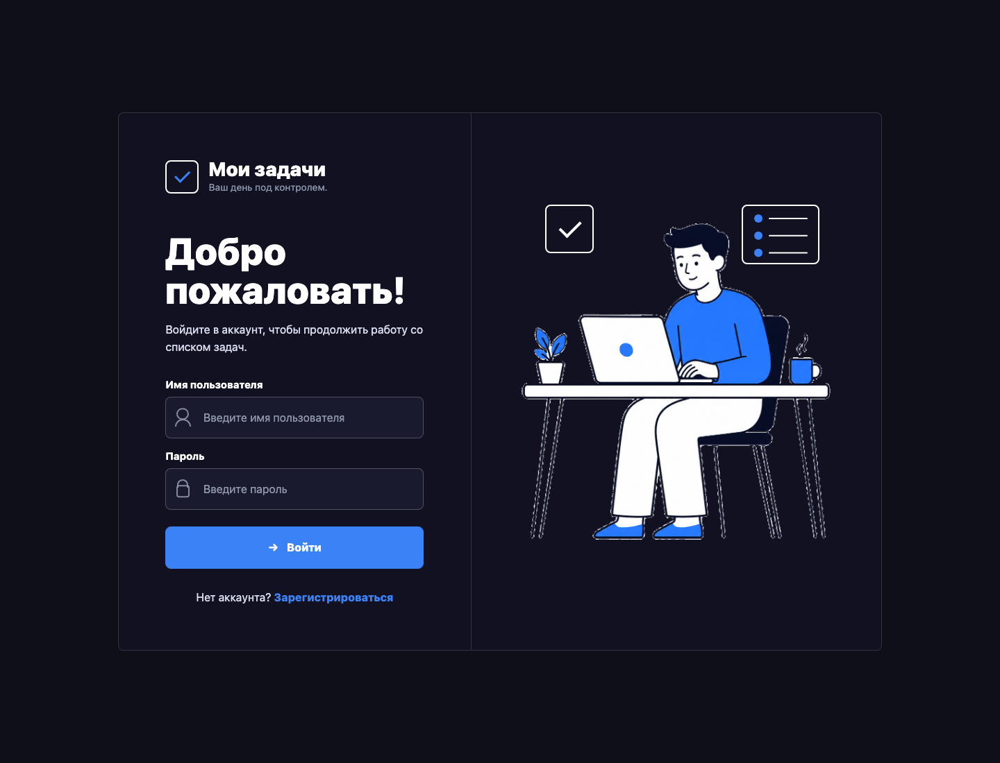
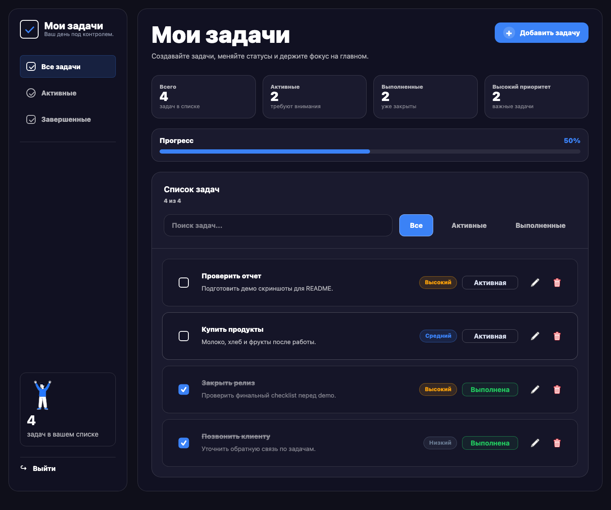
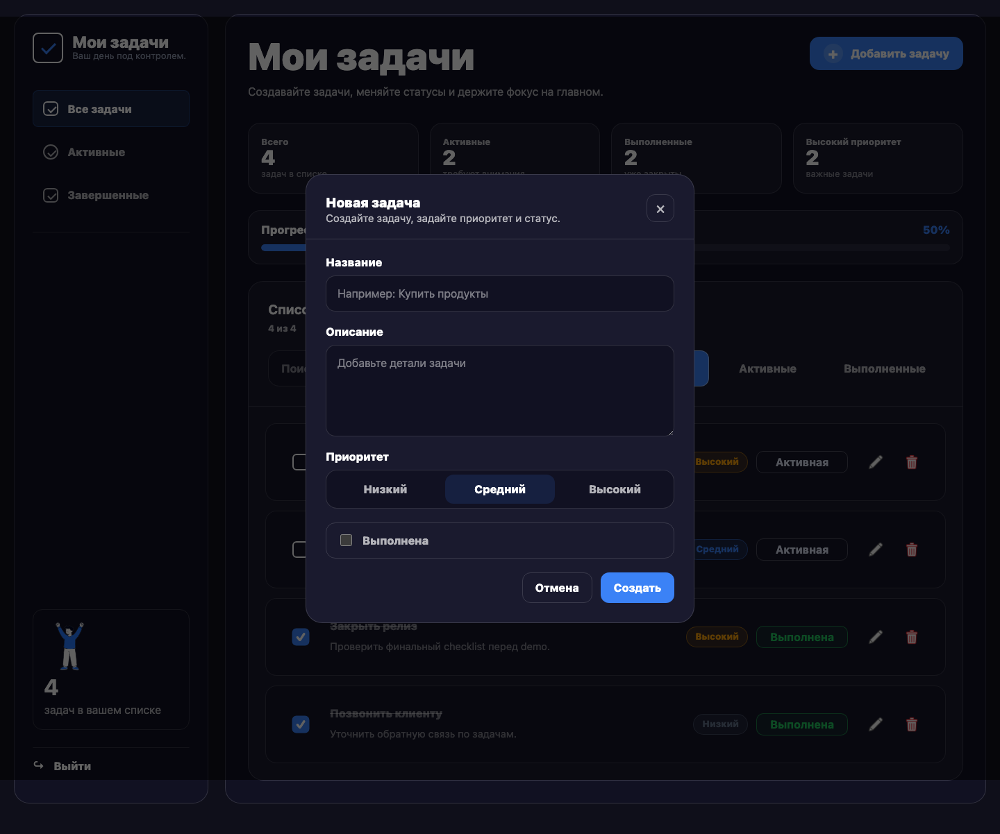
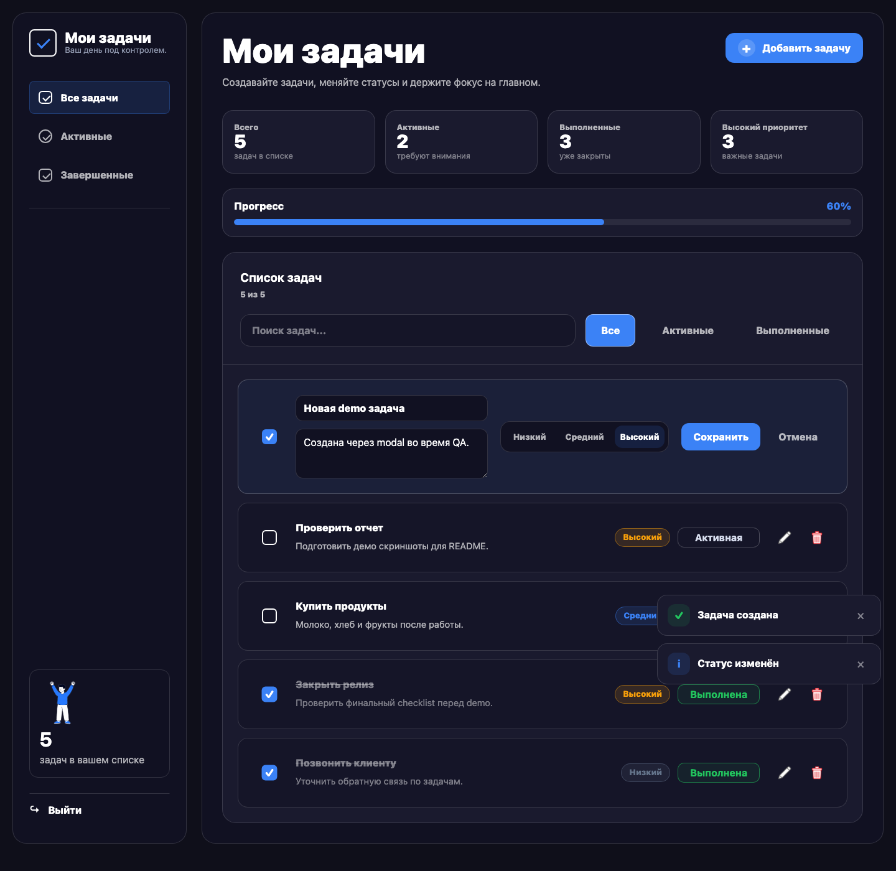
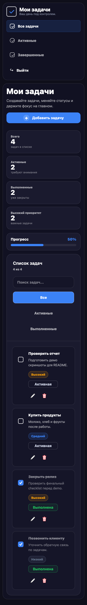

# Todo List

Full-stack Todo List application with Angular frontend and Spring Boot backend. The project focuses on a clean dark navy task workspace with authentication, task CRUD, priorities, fuzzy search, statistics, keyboard-friendly modals, and responsive UI.

## Скриншоты

### Login



### Tasks desktop



### Create task modal



### Inline editing



### Mobile



## Возможности

- Регистрация и вход
- Создание задач через modal
- Inline редактирование
- Confirm dialog удаления
- Toast уведомления
- Приоритеты задач
- Фильтры `Все`, `Активные`, `Выполненные`
- Fuzzy search по названию, описанию, статусу и приоритету
- Статистика задач и progress bar выполнения
- Skeleton loading при загрузке
- Контекстные empty states
- Адаптивная верстка для desktop и mobile

## Стек

- Angular
- TypeScript
- SCSS
- Fuse.js
- Spring Boot
- Java
- REST API
- PostgreSQL

## Запуск frontend

```bash
npm install
npm start
```

Frontend по умолчанию запускается на `http://localhost:4200`.

## Запуск backend

```bash
./gradlew bootRun
```

Backend использует настройки из `src/main/resources/application.properties` и ожидает PostgreSQL database `tododb`.

## Тесты

```bash
npm run build
./gradlew test
```

## Структура проекта

- `src/app` - Angular application: routes, auth flow, task workspace, shared UI.
- `src/styles.scss` - shared dark navy design tokens and reusable UI primitives.
- `src/main/java/com/example/todolist` - Spring Boot backend: controllers, services, security, repositories, entities.
- `src/main/resources` - backend configuration.
- `public/assets` - runtime UI sprites and illustrations.
- `src/assets/screenshots` - README screenshots.

## UX детали

- Dark navy design based on `#0f0f1a`, `#1a1a2e`, `#151528`, and `#3b82f6`.
- Responsive layout without horizontal overflow on mobile.
- Accessible search input, filter buttons, progressbar semantics, and keyboard-friendly modals.
- Toast feedback for create, update, status changes, delete, and load errors.
- Short animations with reduced motion support.
- Skeleton loading uses non-semantic placeholders hidden from assistive tech.

## Known limitations

- Drag and drop ordering is not implemented yet.
- Offline mode is not implemented yet.
- Backend statistics endpoint is not needed yet; statistics are calculated client-side.
